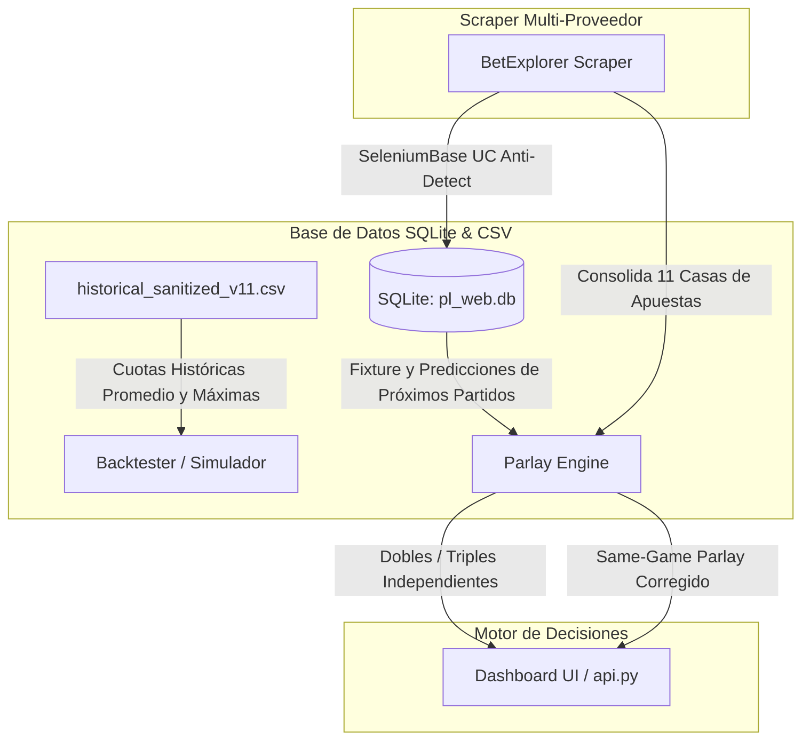

# Reporte Técnico: Arquitectura de Cuotas Reales y Motor de Combinadas (Parlays/SGP)

Este documento resume la implementación, el diseño matemático y la arquitectura de datos desarrollada para integrar cuotas de mercado reales (históricas y futuras) y habilitar sugerencias de apuestas combinadas (Parlays tradicionales y Same-Game Parlays) de forma robusta.

---

## 🗺️ Mapa de Flujo de Datos e Integración

El sistema interactúa a través de tres capas principales, conectando el scraper en vivo, los modelos de ML y el motor de parlays con la base de datos de producción:

---

## 📌 Eje 1: Integración de Cuotas Reales e Impacto de "Line Shopping"

### 1. Histórico (v11.csv)
Fucionamos las cuotas máximas de mercado (`Max_*`) para los 7 mercados en todo el dataset de **2,355 partidos** (2017-2026).
* **Impacto Financiero (Simulación Walk-Forward):**
  * **Cuotas Promedio / Bet365:** ROI = **$6.99\%$** | Banca Final = **$1,594.66$** | Drawdown Máximo = **$27.01\%$**
  * **Cuotas Máximas (Line Shopping):** ROI = **$13.38\%$** | Banca Final = **$2,171.81$** | Drawdown Máximo = **$23.97\%$**
  * *Resultado:* Buscar la mejor cuota disponible **duplicó el ROI de la inversión** y disminuyó el riesgo de pérdidas acumuladas.

### 2. Extracción de Eventos Futuros (Scraper BetExplorer)
Desarrollamos un crawler SeleniumBase en `odds_scraper_free.py` capaz de:
* Evadir los desafíos de Cloudflare UC de forma automatizada.
* Cargar el fixture y navegar recursivamente por las páginas de detalles.
* Hacer click dinámico en las pestañas `O/U` y `BTTS` y parsear las cuotas de **11 casas de apuestas**.
* Calcular cuotas máximas, promedios e insertar el mapa JSON completo (`all_providers_odds`) en SQLite.

---

## 📌 Eje 2: Lógica y Matemática del Motor de Combinadas (Parlays)

El motor de combinadas en `parlay_engine.py` separa de forma limpia y modular las dos lógicas de apuestas combinadas:

### 1. Combinadas Multi-Partido (Independientes)
* **Matemática:** Las cuotas y las probabilidades se multiplican directamente al tratarse de eventos sin correlación:
  $$C_{\text{comb}} = \prod_i C_i \quad \text{y} \quad P_{\text{comb}} = \prod_i P_i$$
* **Stake:** Se sugiere utilizando **1/10 Kelly** (para dobles) y **1/20 Kelly** (para triples) sobre el EV+ combinado.

### 2. Combinadas del Mismo Partido (Same-Game Parlays - SGP)
Al combinar mercados dependientes de un mismo partido (ej: Victoria Local + BTTS + Over 2.5), la multiplicación simple está sesgada. Calculamos los **Factores de Ajuste Ratios de Correlación** reales de la Premier League:

* **Local Gana + Over 2.5:** Ratio = **`1.1655`** (+16.5% de co-ocurrencia)
* **Local Gana + BTTS:** Ratio = **`0.8680`** (-13.2% de co-ocurrencia)
* **Local Gana + Valla Invicta:** Ratio = **`1.8127`** (+81.3% de co-ocurrencia)
* **Over 2.5 + BTTS:** Ratio = **`1.4564`** (+45.6% de co-ocurrencia)
* **Under 2.5 + BTTS (No):** Ratio = **`1.6139`** (+61.4% de co-ocurrencia)
* **Local Gana + Over 2.5 + BTTS:** Ratio = **`1.5952`** (+59.5% de co-ocurrencia)

#### Fórmulas de Corrección de SGP:
* **Probabilidad Conjunta:** 
  $$P_{\text{SGP}} = (P_1 \times P_2 \times \dots) \times \text{Ratio}$$
* **Cuota SGP Estimada (con margen del 8%):**
  $$C_{\text{SGP}} = (C_1 \times C_2 \times \dots) \times \frac{1}{\text{Ratio}} \times 0.92$$

---

## 📌 Eje 3: Estructura de la API

* **GET `/api/matches/parlays?oddsSource=maximum`**
  * Devuelve una respuesta JSON estructurada dividida en:
    * `doubles`: Top 5 combinadas dobles multi-partido.
    * `trebles`: Top 5 combinadas triples multi-partido.
    * `same_game`: Top 5 Same-Game Parlays en un mismo partido ajustadas por correlación.
* **POST `/api/matches/upcoming/update`**
  * Fuerza la recarga e inserción de nuevas cuotas scrapeadas en SQLite de forma interactiva.
